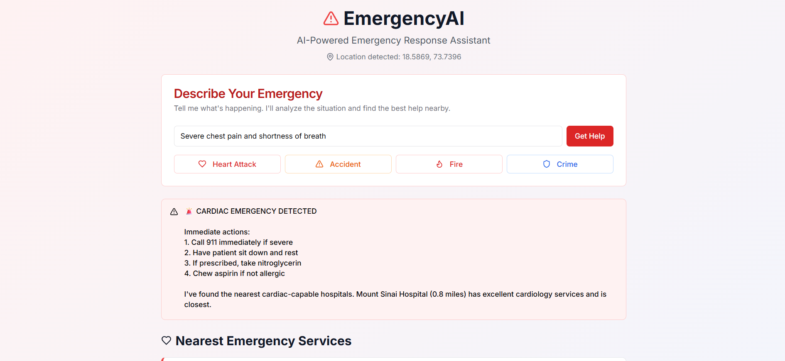
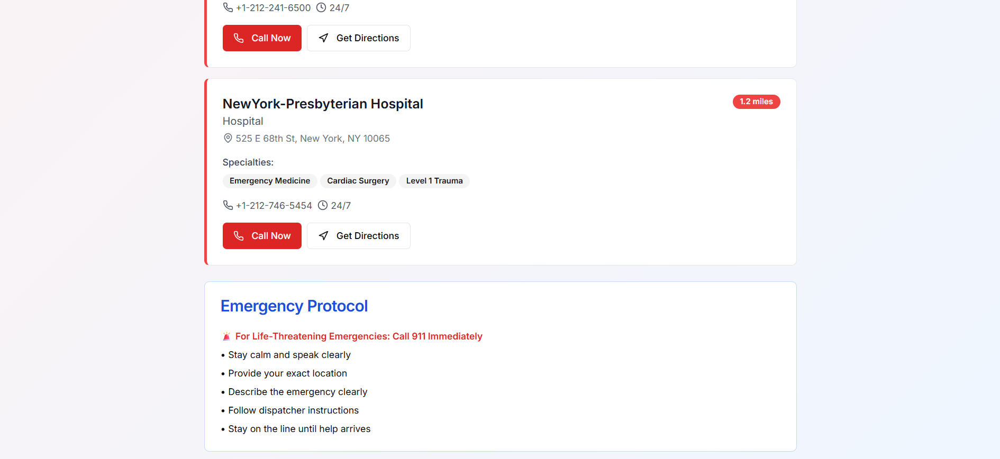

### EmergencyAI - Intelligent Emergency Response Assistant

I'm building **EmergencyAI**, a life-saving agentic application that uses AI and location intelligence to provide instant emergency assistance. This addresses one of the most critical real-world problems: **emergency response time and accessibility**.

## Problem Statement

Every second counts in emergencies, but people often:

- Don't know the nearest appropriate emergency services
- Waste time calling wrong services
- Can't communicate effectively in crisis situations
- Lack access to critical contextual information about emergency facilities

## Solution: EmergencyAI

An AI-powered emergency assistant that:

1. **Intelligently assesses** emergency situations through natural language
2. **Finds the most relevant** emergency services using Foursquare Places API
3. **Provides contextual information** about facilities (hours, specialties, contact info)
4. **Takes immediate action** with one-click calling, directions, and emergency protocols

